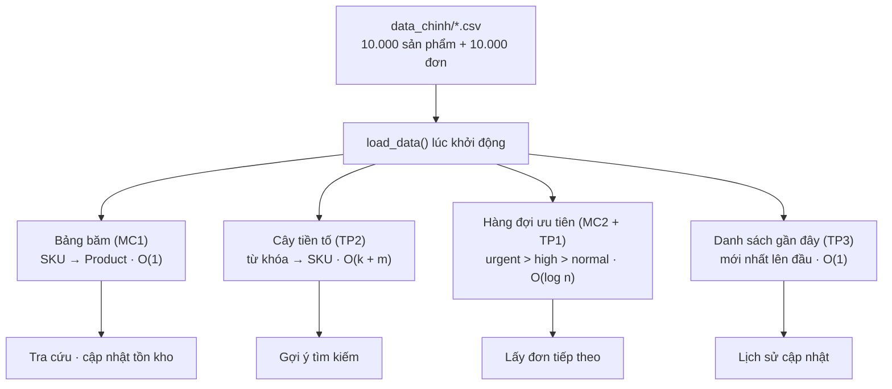
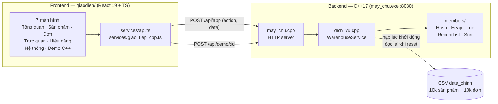
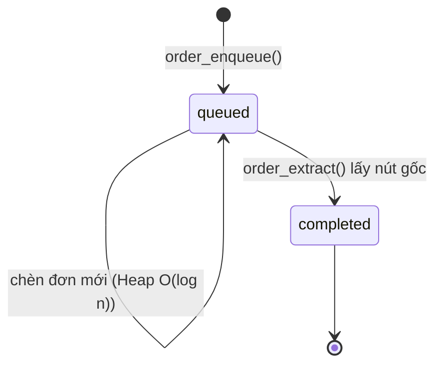
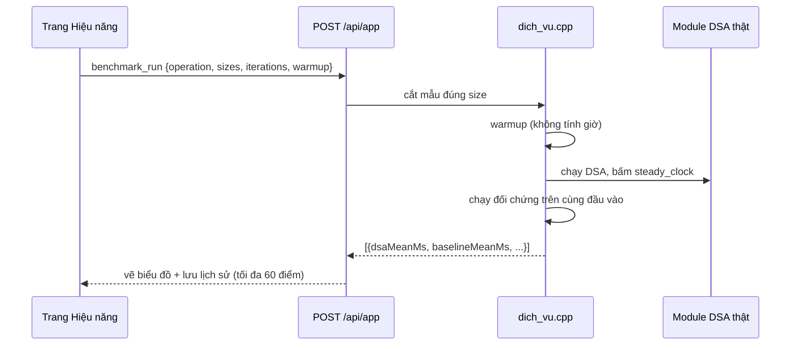

# Quản lý kho & đơn hàng (Ecommerce Warehouse DSA)


Đồ án Cấu trúc dữ liệu & Giải thuật: hệ thống quản lý kho và đơn hàng vận hành
hoàn toàn trên cấu trúc dữ liệu tự cài đặt bằng **C++17**, giao diện **React + TypeScript**
hiển thị trực tiếp trạng thái và số đo hiệu năng từ backend.

Không dùng database. CSV chỉ lưu dữ liệu gốc; mọi nghiệp vụ chạy trên Hash Table,
Heap, Trie và danh sách liên kết đôi + bảng băm nằm trong bộ nhớ của tiến trình C++.

## Tính năng chính

| Nghiệp vụ | Cấu trúc dữ liệu | Độ phức tạp |
| --- | --- | --- |
| Tra cứu sản phẩm theo SKU (MC1) | Bảng băm tự cài đặt | Trung bình O(1) |
| Xử lý đơn theo ưu tiên (MC2 + TP1) | Hàng đợi ưu tiên (max-heap), cùng mức thì số thứ tự nhỏ đi trước | Xem O(1), chèn/lấy O(log n) |
| Gợi ý theo tiền tố (TP2) | Cây tiền tố | O(k + m) |
| Theo dõi cập nhật tồn kho gần đây (TP3) | Danh sách liên kết đôi + bảng băm | O(1) |
| Sắp xếp phục vụ benchmark | Merge Sort tự cài đặt, đối chứng `std::stable_sort` | O(n log n) |

Giao diện gồm 7 màn hình: Tổng quan, Sản phẩm, Hàng đợi đơn, Trực quan DSA,
Hiệu năng, Dữ liệu & hệ thống, và Demo C++ (`/cpp` chạy `chay_thu.cpp` của từng
thành viên). Mọi số liệu trên giao diện đều do backend C++ trả về, không có dữ
liệu dựng sẵn ở frontend.



## Kiến trúc



```text
giaodien/ (React + TS) ── HTTP/JSON ──▶ may_chu.cpp ──▶ dich_vu.cpp ──▶ module DSA
     │                                       │                  └──▶ CSV data_chinh
     │                                       │                      (chỉ đọc lúc nạp / nạp lại)
     ├── POST /api/app      → nghiệp vụ (tra cứu, đơn, benchmark, …)
     └── POST /api/demo/:id → chạy chay_thu.cpp của từng thành viên
```

Vòng đời một đơn hàng:



Quy ước quan trọng:

* File chức năng (`.cpp` của thành viên) được `#include` vào điểm vào,
  **không biên dịch riêng** để tránh định nghĩa trùng.
* Heap so sánh `urgent > high > normal`; cùng mức ưu tiên thì `sequence` nhỏ hơn đi trước.
* Server nạp `data_chinh` vào 4 cấu trúc ngay khi khởi động. Thêm sản phẩm, cập nhật
  tồn kho, xử lý đơn dùng chung một trạng thái; nút **Nạp lại dữ liệu** đọc lại CSV gốc.
* Benchmark đo trong C++ bằng `steady_clock`, có chạy khởi động (warmup), lặp nhiều lần
  lấy trung bình, cộng dồn checksum để trình biên dịch không loại bỏ phép đo.
  HTTP/JSON/render không tính vào thời gian DSA.



## Công nghệ

| Lớp | Dùng gì |
| --- | --- |
| Backend | C++17, `nlohmann/json`, `cpp-httplib` (tự tải vào `backend/thu_vien/`) |
| Frontend | React 19, TypeScript, TanStack Router + Query, Tailwind CSS 4, Recharts |
| Dữ liệu | CSV (`san_pham.csv`, `don_hang.csv`), chuẩn hóa bằng `scripts/lam_sach.cpp` |
| Build/dev | Node.js 22.12+, g++, npm scripts tại gốc repo |

## Chạy dự án

Yêu cầu: Node.js 22.12+ và g++ hỗ trợ C++17. Mọi lệnh chạy tại gốc repo.

```powershell
# Cài giao diện (lần đầu)
npm --prefix giaodien install

# Chạy cả backend C++ và giao diện
npm run dev
```

Nhấn `Ctrl+C` để dừng cả hai. Lần đầu lệnh trên tự tải thư viện C++ và biên dịch.
Backend mặc định cổng `8080` (proxy cấu hình tại `giaodien/vite.config.ts`).
Sửa C++ xong thì dừng backend, build và start lại:

```powershell
# Terminal backend
npm run backend:build
npm run backend:start

# Terminal giao diện
npm run frontend:dev
```

| Lệnh | Tác dụng |
| --- | --- |
| `npm run dev` | Build (nếu thiếu) + chạy backend và frontend cùng lúc |
| `npm run demo -- <id> [input.json] [--release]` | Chạy demo `chay_thu.cpp` của một thành viên |
| `npm run data:setup` | Tải nguồn, kiểm tra SHA256, tạo lại dữ liệu |
| `npm run check:bridge` | Kiểm tra cầu HTTP/JSON backend ↔ frontend |
| `npm run frontend:build` | Build production giao diện |

## Cấu trúc repo

```text
backend/
  members/<ten>/   Module DSA của từng thành viên (thuat_toan + chay_thu + kiem_thu + huong_dan)
  app/             may_chu.cpp (HTTP) · dich_vu.cpp (nghiệp vụ) · chay_dong_lenh.cpp (CLI demo)
  shared/          Kiểu dữ liệu và phản hồi demo dùng chung
  data/data_chinh/ Dữ liệu chính: 10.000 sản phẩm + 10.000 đơn (liên kết đủ qua SKU)
giaodien/src/
  routes/          7 màn hình (index, products, orders, visualizer, performance, system, cpp)
  components/      UI dùng chung (badges, states, Pagination, HeapTree, …)
  services/        api.ts (nghiệp vụ) · giao_tiep_cpp.ts (demo C++)
  core/ · lib/     Kiểu dữ liệu, format, tiện ích
scripts/           Build C++, làm sạch dữ liệu, kiểm tra kết nối
```

Thư viện tải về (`backend/thu_vien/`), kết quả build và dữ liệu thô đầy đủ
(`backend/data/goc/`, `backend/data/day_du/`) không đưa vào Git.

## Dữ liệu

Bộ chính: [10.000 sản phẩm](backend/data/data_chinh/san_pham.csv) và
[10.000 đơn chờ](backend/data/data_chinh/don_hang.csv), liên kết đủ qua SKU.
Benchmark lấy 1.000 / 5.000 / 10.000 dòng đầu để thử nhiều quy mô.
Schema, nguồn và quy tắc chuẩn hóa xem [hướng dẫn dữ liệu](backend/data/huong_dan.md).

## Kiểm thử

* Mỗi thành viên có test `main()` riêng trong `kiem_thu/`, biên dịch và chạy độc lập.
  Ví dụ test của Khang:

```powershell
g++ -std=c++17 -Wall -Wextra -Wpedantic -I backend backend/members/nguyen_khang/kiem_thu/kiem_tra.cpp -o backend/build/kiem_tra_nguyen_khang.exe
.\backend\build\kiem_tra_nguyen_khang.exe
```

* Cổng kiểm tra chất lượng trước khi đẩy code:

```powershell
npm run check:bridge
npm run frontend:build
npm --prefix giaodien run typecheck
npm --prefix giaodien run lint
```

## Phân công

Theo [Plan DSA.docx](Plan%20DSA.docx).

| Thành viên | MSSV | Hướng dẫn | Phụ trách |
| --- | --- | --- | --- |
| Hồ Nhật Minh | 24133039 | [nhat_minh](backend/members/nhat_minh/huong_dan.md) | Heap, MC2 + TP1 |
| Dương Thị Kim Ngân | 24133040 | [kim_ngan](backend/members/kim_ngan/huong_dan.md) | Trie, TP2 |
| Nguyễn Thị Kiều Trang | 24133064 | [kieu_trang](backend/members/kieu_trang/huong_dan.md) | Hash Table, CSV, MC1 |
| Nguyễn Thị Ngọc Trâm | 24133066 | [ngoc_tram](backend/members/ngoc_tram/huong_dan.md) | RecentList, kiểm thử, TP3 |
| Bùi Nguyễn Nguyên Khang | 24133902 | [nguyen_khang](backend/members/nguyen_khang/huong_dan.md) | Merge Sort, tìm kiếm, benchmark, giao diện |
