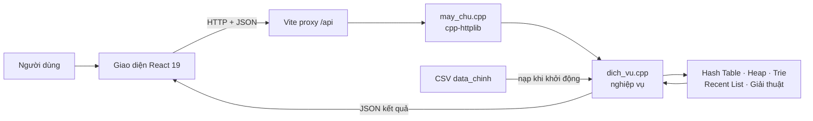

# CHƯƠNG 6. GIẢI THUẬT, ĐÁNH GIÁ HIỆU NĂNG VÀ GIAO DIỆN DEMO

Chương này trình bày phần giải thuật, đánh giá hiệu năng và tổ chức demo do Bùi Nguyễn Nguyên Khang phụ trách. Trọng tâm của chương là làm rõ mối liên hệ giữa lý thuyết độ phức tạp và hành vi thực tế của chương trình quản lý kho: dữ liệu được chuẩn bị như thế nào, vì sao từng giải thuật được chọn, cách nhóm tổ chức phép đo và cách kết quả từ backend C++ được đưa lên giao diện React.

Mục tiêu của thực nghiệm không phải chứng minh mọi giải thuật tự cài đặt đều nhanh hơn thư viện chuẩn. Mục tiêu chính là kiểm tra ba vấn đề: giải thuật có cho kết quả đúng hay không, thời gian xử lý thay đổi ra sao khi quy mô dữ liệu tăng, và cấu trúc dữ liệu được chọn có phù hợp với nghiệp vụ hay không. Vì vậy, chương báo cáo cả những kết quả thuận lợi lẫn trường hợp giải thuật tự cài đặt chậm hơn phương pháp đối chứng.

Toàn bộ mô tả kỹ thuật và số liệu trong chương được đối chiếu với phiên bản mã nguồn hiện có của nhóm. Các con số chỉ được đưa vào báo cáo sau khi chạy trực tiếp trên backend C++; số liệu giả định hoặc ước lượng không được sử dụng.

## 6.1. Các giải thuật tìm kiếm và sắp xếp

Danh mục sản phẩm được đọc từ `san_pham.csv` và lưu trong `std::vector<Product>`. Mỗi phần tử chứa thông tin của một sản phẩm, trong đó SKU đóng vai trò khóa nhận diện. Trên cùng tập dữ liệu này, nhóm cài đặt ba giải thuật trong `backend/members/nguyen_khang/thuat_toan.cpp`: Merge Sort để tạo danh mục có thứ tự, Binary Search để tìm trên danh mục đã sắp xếp và Linear Search để làm phương pháp đối chứng.

Ba giải thuật tạo thành một chuỗi xử lý hoàn chỉnh. Merge Sort đảm nhiệm bước chuẩn bị dữ liệu; Binary Search khai thác thứ tự đã tạo để giảm phạm vi tìm kiếm; Linear Search cho thấy chi phí khi không có bước chuẩn bị và phải duyệt lần lượt từng phần tử. Cách tổ chức này giúp so sánh không chỉ thời gian của hai thuật toán tìm kiếm mà còn cả chi phí cần bỏ ra trước khi tìm.

### 6.1.1. Merge Sort

Merge Sort được lựa chọn vì có thời gian `O(n log n)` ổn định trong mọi trường hợp và dễ thể hiện tư tưởng chia để trị. Với một đoạn dữ liệu từ vị trí `left` đến trước vị trí `right`, thuật toán thực hiện ba bước:

1. Tìm vị trí giữa của đoạn.
2. Gọi đệ quy để sắp xếp nửa trái và nửa phải.
3. Trộn hai nửa đã có thứ tự thành một đoạn hoàn chỉnh.

Điều kiện dừng xuất hiện khi đoạn đang xét có không quá một phần tử, vì một phần tử tự nó đã có thứ tự. Sau khi hai lời gọi đệ quy hoàn thành, bước trộn dùng hai con trỏ để so sánh phần tử đầu chưa xử lý của mỗi nửa. Phần tử có SKU nhỏ hơn được đưa vào mảng tạm, sau đó con trỏ tương ứng tiến thêm một vị trí. Khi một nửa đã hết, các phần tử còn lại của nửa kia được chép nối tiếp vào kết quả.

Ví dụ, danh sách SKU `[PRD-D, PRD-A, PRD-C, PRD-B]` được chia thành hai nửa `[PRD-D, PRD-A]` và `[PRD-C, PRD-B]`. Sau khi mỗi nửa được sắp xếp, hai dãy `[PRD-A, PRD-D]` và `[PRD-B, PRD-C]` được trộn thành `[PRD-A, PRD-B, PRD-C, PRD-D]`. Ví dụ này cho thấy mỗi lần trộn chỉ làm việc với hai đoạn đã có thứ tự, nhờ đó việc chọn phần tử tiếp theo trở nên đơn giản.

Mã nguồn dùng điều kiện `products[i].sku <= products[j].sku`. Dấu bằng có ý nghĩa: nếu hai khóa giống nhau, phần tử thuộc nửa trái được đưa vào trước. Thứ tự tương đối ban đầu của các phần tử có cùng khóa vì vậy được bảo toàn, nên đây là một cách cài đặt Merge Sort ổn định. Dữ liệu chính hiện xem SKU là duy nhất, nhưng việc giữ tính ổn định vẫn làm cho giải thuật tổng quát và an toàn hơn nếu tiêu chí sắp xếp được thay đổi sau này.

Quan hệ truy hồi của giải thuật là `T(n) = 2T(n/2) + O(n)`: hai nửa có kích thước xấp xỉ `n/2` được sắp xếp độc lập, còn bước trộn duyệt tổng cộng `n` phần tử. Dữ liệu được chia khoảng `log₂n` mức, vì vậy thời gian ở trường hợp tốt, trung bình và xấu nhất đều là `O(n log n)`. Mảng tạm có kích thước `n` làm bộ nhớ phụ đạt `O(n)`; độ sâu lời gọi đệ quy là `O(log n)`.

Trong đồ án, Merge Sort có hai vai trò. Thứ nhất, nó chuẩn bị danh mục có thứ tự cho Binary Search. Thứ hai, nó được đặt cạnh `std::stable_sort` để đánh giá chất lượng cài đặt của nhóm. Chi phí sắp xếp được đo riêng và không được cộng vào thời gian của từng lần Binary Search, nhờ đó báo cáo phân biệt rõ chi phí chuẩn bị với chi phí tra cứu.

### 6.1.2. Binary Search

Binary Search chỉ đúng khi danh mục đã được sắp xếp tăng dần theo SKU. Thuật toán quản lý khoảng tìm kiếm nửa kín `[left, right)`, trong đó `left` thuộc khoảng còn `right` không thuộc khoảng. Ở mỗi vòng lặp, SKU cần tìm được so sánh với phần tử giữa:

- Nếu hai SKU bằng nhau, hàm trả về vị trí tìm thấy.
- Nếu SKU ở giữa nhỏ hơn khóa cần tìm, tiếp tục ở nửa phải.
- Nếu SKU ở giữa lớn hơn khóa cần tìm, tiếp tục ở nửa trái.

Sau mỗi lần so sánh, ít nhất một nửa không gian tìm kiếm được loại bỏ. Với 10.000 sản phẩm, số lần thu hẹp tối đa chỉ vào khoảng 14 bước so sánh vị trí, thay vì có thể phải kiểm tra đến 10.000 phần tử như Linear Search. Thời gian tốt nhất là `O(1)` khi SKU nằm ngay vị trí giữa; thời gian trung bình và xấu nhất là `O(log n)`. Thuật toán chỉ lưu các chỉ số biên và vị trí giữa nên bộ nhớ phụ là `O(1)`.

Điều cần lưu ý là lợi thế trên chỉ có được sau bước sắp xếp. Nếu dữ liệu chưa có thứ tự và chỉ phát sinh một truy vấn, tổng chi phí gồm `O(n log n)` để sắp xếp cộng với `O(log n)` để tìm. Nếu danh mục được sắp xếp một lần rồi phục vụ nhiều truy vấn, chi phí chuẩn bị được chia cho nhiều lượt tìm và Binary Search bắt đầu phát huy hiệu quả.

Hàm trong chương trình trả về `std::optional<std::size_t>`. Khi tìm thấy, kết quả chứa vị trí của sản phẩm; khi không tìm thấy, kết quả là `std::nullopt`. Cách biểu diễn này giúp phân biệt rõ vị trí số 0 với trường hợp không có kết quả.

### 6.1.3. Linear Search

Linear Search không yêu cầu dữ liệu có thứ tự và không cần bước chuẩn bị. Thuật toán bắt đầu từ phần tử đầu tiên, so sánh SKU của từng sản phẩm với khóa cần tìm và dừng ngay khi gặp kết quả phù hợp. Nếu đã duyệt hết danh mục mà chưa gặp khóa, thuật toán kết luận sản phẩm không tồn tại.

Trường hợp tốt nhất có độ phức tạp `O(1)` khi sản phẩm nằm ngay đầu danh sách. Trong trường hợp trung bình, thuật toán phải xem một phần đáng kể của danh sách; ở trường hợp xấu nhất, sản phẩm nằm cuối hoặc không tồn tại và toàn bộ `n` phần tử phải được kiểm tra. Khi đó thời gian là `O(n)`. Thuật toán chỉ dùng biến chỉ số nên bộ nhớ phụ là `O(1)`.

Linear Search được giữ làm đối chứng vì nó trực tiếp, dễ kiểm tra và không được hưởng lợi từ dữ liệu đã sắp xếp hoặc cấu trúc chỉ mục. Khi quy mô tăng, sự thay đổi thời gian của Linear Search tạo đường cơ sở rõ ràng để đánh giá Binary Search và Hash Table.

### 6.1.4. So sánh ba giải thuật

| Giải thuật | Điều kiện đầu vào | Thời gian trung bình | Thời gian xấu nhất | Bộ nhớ phụ | Vai trò trong đồ án |
| --- | --- | ---: | ---: | ---: | --- |
| Merge Sort | Không yêu cầu có thứ tự | `O(n log n)` | `O(n log n)` | `O(n)` | Sắp xếp sản phẩm theo SKU |
| Binary Search | Dữ liệu đã sắp xếp | `O(log n)` | `O(log n)` | `O(1)` | Tìm nhanh trên danh mục đã sắp xếp |
| Linear Search | Không yêu cầu có thứ tự | `O(n)` | `O(n)` | `O(1)` | Làm cách tìm kiếm đối chứng |

Không có giải thuật nào tốt nhất cho mọi tình huống. Linear Search phù hợp với danh sách nhỏ hoặc chỉ tìm rất ít lần. Binary Search phù hợp khi dữ liệu có thể giữ theo thứ tự và có nhiều truy vấn. Merge Sort phù hợp khi cần thời gian `O(n log n)` ổn định và cần bảo toàn thứ tự của các phần tử cùng khóa.

Việc so sánh Binary Search với Linear Search trong chương này nhằm minh họa tác động của bước chuẩn bị dữ liệu. Trong nghiệp vụ tra cứu SKU chính của hệ thống, nhóm sử dụng bảng băm tự cài đặt vì yêu cầu là tìm chính xác theo khóa và dữ liệu còn có các thao tác cập nhật. Binary Search vẫn cần thiết trong đồ án để thể hiện phần giải thuật tìm kiếm trên mảng có thứ tự và làm đối chứng học thuật.

## 6.2. Phương pháp đo hiệu năng

### 6.2.1. Mục tiêu và nguyên tắc đo

Benchmark được thiết kế để trả lời ba câu hỏi. Thứ nhất, khi số bản ghi tăng thì thời gian của từng phương pháp thay đổi như thế nào? Thứ hai, giải pháp DSA có tạo ra khác biệt rõ ràng so với cách xử lý tuần tự hay không? Thứ ba, chi phí chuẩn bị dữ liệu có ảnh hưởng đến kết luận hay không?

Đối tượng được đo là phần xử lý thuật toán trong tiến trình C++. Thời gian gửi HTTP, phân tích JSON và vẽ biểu đồ React không được cộng vào kết quả vì các thành phần này không phản ánh trực tiếp hiệu năng của cấu trúc dữ liệu. Frontend chỉ nhận cấu hình từ người dùng, yêu cầu backend thực hiện phép đo và trình bày các điểm kết quả.

Các nguyên tắc được áp dụng gồm:

1. Dùng `std::chrono::steady_clock` để đo khoảng thời gian. Đây là đồng hồ đơn điệu, không bị ảnh hưởng khi giờ hệ thống thay đổi trong lúc đo.
2. Chuyển khoảng thời gian sang mili giây bằng `std::chrono::duration<double, std::milli>`.
3. Chạy khởi động trước khi đo chính thức để dữ liệu và mã thực thi được truy cập ít nhất một lần.
4. Lặp phép đo nhiều lần rồi chia tổng thời gian cho số lượt lặp.
5. Dùng biến `volatile` cộng dồn kết quả để trình biên dịch không loại bỏ phần mã đang được đo vì kết quả không được sử dụng.
6. Dùng cùng dữ liệu hoặc cùng truy vấn cho phương pháp DSA và phương pháp đối chứng.
7. Kiểm tra tính đúng đắn của kết quả, không chỉ kiểm tra thời gian.

`steady_clock` được chọn vì giá trị của nó chỉ tăng theo thời gian, phù hợp để đo một khoảng thực thi. Báo cáo không giả định đồng hồ luôn có độ phân giải nano giây, vì độ phân giải thực tế còn phụ thuộc hệ điều hành và phần cứng. Chương trình chuyển kết quả sang mili giây để thống nhất cách hiển thị giữa terminal, API và biểu đồ.

### 6.2.2. Môi trường thực nghiệm

Lần đo dùng trong chương được thực hiện ngày 03/10/2026 với cấu hình phần mềm sau:

| Thành phần | Cấu hình |
| --- | --- |
| Hệ điều hành | Windows 64-bit |
| Ngôn ngữ backend | C++17 |
| Trình biên dịch | g++ 14.2.0, MSYS2 |
| Tùy chọn tối ưu | `-O2` |
| Dữ liệu chính | 10.000 sản phẩm và 10.000 đơn hàng |
| Quy mô đo | 1.000, 5.000 và 10.000 bản ghi |
| Đơn vị kết quả | Mili giây trên một thao tác |

Hai file CSV đều có 10.001 dòng, gồm một dòng tiêu đề và 10.000 dòng dữ liệu. Ba mốc 1.000, 5.000 và 10.000 được chọn để thể hiện quy mô nhỏ, trung bình và toàn bộ tập dữ liệu chính. Ở mỗi mốc, chương trình lấy cùng phần đầu của dữ liệu để các phương pháp được so sánh trên cùng một tập bản ghi.

Biến độc lập của thực nghiệm là quy mô dữ liệu và loại phép toán. Biến phụ thuộc là thời gian trung bình trên một thao tác. Những yếu tố được giữ cố định gồm dữ liệu đầu vào, cách sinh truy vấn, trình biên dịch, mức tối ưu `-O2` và tiến trình C++ thực hiện phép đo.

### 6.2.3. Cách tạo truy vấn tìm kiếm

Benchmark riêng của Nguyên Khang tạo trước danh sách truy vấn theo tỷ lệ:

- Bốn trong mỗi năm truy vấn là SKU có thật trong dữ liệu.
- Một trong mỗi năm truy vấn là `__SKU_KHONG_TON_TAI__`.

Các SKU có thật được chọn bằng một bước nhảy cố định qua danh mục thay vì luôn lấy phần tử đầu. Cách này phân bố truy vấn qua nhiều vị trí trong dữ liệu. Việc bổ sung truy vấn không tồn tại buộc cả hai giải thuật xử lý trường hợp thất bại, tránh một kịch bản chỉ gồm những lần tìm thấy thuận lợi.

Binary Search chạy trên bản sao đã được Merge Sort, còn Linear Search chạy trên bản sao giữ nguyên thứ tự ban đầu. Hai giải thuật dùng chính xác cùng danh sách truy vấn. Sau khi đo, chương trình kiểm tra từng SKU để bảo đảm hai cách cùng kết luận tìm thấy hoặc không tìm thấy. Nếu kết quả khác nhau, benchmark dừng và báo lỗi thay vì tiếp tục xuất số liệu.

### 6.2.4. Các cặp phương pháp được đối chứng

| Phép đo | Giải pháp DSA | Phương pháp đối chứng | Nội dung cần quan sát |
| --- | --- | --- | --- |
| Tìm SKU | Binary Search trên mảng đã sắp xếp | Linear Search trên mảng ban đầu | Lợi ích của việc thu hẹp một nửa phạm vi tìm kiếm |
| Tra cứu sản phẩm | Hash Table tự cài đặt | Duyệt tuần tự danh sách sản phẩm | Khả năng truy cập trực tiếp theo khóa |
| Lấy đơn ưu tiên | Lấy gốc Max-Heap | Duyệt toàn bộ danh sách để tìm đơn ưu tiên nhất rồi xóa | Chi phí duy trì thứ tự ưu tiên |
| Gợi ý theo tiền tố | Trie tự cài đặt | Duyệt toàn bộ SKU và kiểm tra tiền tố | Lợi ích của việc chia sẻ đường đi theo ký tự |
| Sắp xếp ban đầu | Merge Sort tự cài đặt | `std::stable_sort` của thư viện chuẩn C++ | Chất lượng cài đặt sinh viên so với thư viện đã tối ưu |

Số lần lặp được chọn theo chi phí của từng phép đo: 1.000 lượt cho tìm kiếm và Hash Table, 500 lượt cho Trie, 100 lượt cho Heap và sắp xếp. Tất cả các phép đo đều bật `warmup`.

### 6.2.5. Quy trình đo và xử lý kết quả

Mỗi điểm dữ liệu được tạo theo cùng một quy trình. Trước hết, chương trình kiểm tra quy mô yêu cầu không vượt quá số bản ghi đã nạp. Tiếp theo, cấu trúc dữ liệu cần thiết được xây dựng, chẳng hạn tạo Hash Table, Trie, Heap hoặc bản sao sản phẩm đã sắp xếp. Nếu bật warmup, chương trình thực hiện thử một thao tác nhưng không đưa lần này vào kết quả. Sau đó đồng hồ được bắt đầu, phép toán được lặp đủ số lần, kết quả được cộng vào checksum và đồng hồ được dừng. Cuối cùng, tổng thời gian được chia cho số lượt lặp để thu được thời gian trung bình trên một thao tác.

Hệ số so sánh được tính bằng thời gian đối chứng chia cho thời gian DSA. Hệ số lớn hơn `1` cho biết giải pháp DSA nhanh hơn; hệ số bằng `1` cho biết hai cách xấp xỉ nhau; hệ số nhỏ hơn `1` cho biết phương pháp đối chứng nhanh hơn. Báo cáo dùng tên “tỷ lệ đối chứng/DSA” trong bảng để tránh gọi nhầm là “nhanh hơn” khi tỷ lệ nhỏ hơn `1`.

Với Binary Search, thời gian Merge Sort chuẩn bị được ghi thành một cột riêng. Với Heap và Merge Sort, mỗi lượt lặp dùng một bản sao dữ liệu để thao tác trước đó không làm thay đổi đầu vào của lượt tiếp theo. Việc sao chép được đặt ngoài đoạn bấm giờ khi mục tiêu chỉ là đo thao tác cần so sánh.

### 6.2.6. Giới hạn của phép đo

Kết quả trong chương phản ánh một lần chạy trên máy phát triển của nhóm, không phải hằng số áp dụng cho mọi máy. Các tác vụ nền, xung nhịp CPU, bộ nhớ đệm, trạng thái cấp phát bộ nhớ và phiên bản trình biên dịch có thể làm số đo thay đổi. Những giá trị nhỏ hơn `0,001 ms` đặc biệt nhạy với môi trường chạy, nên chênh lệch nhỏ giữa hai mốc không đủ để kết luận thời gian tuyệt đối tăng hoặc giảm.

Thực nghiệm hiện dùng giá trị trung bình và chưa báo cáo độ lệch chuẩn hoặc khoảng tin cậy. Đây là giới hạn cần thừa nhận khi diễn giải. Kết luận của chương vì vậy dựa chủ yếu vào xu hướng khi quy mô tăng, sự khác biệt về bậc độ phức tạp và khoảng cách đủ lớn giữa hai phương pháp. Khi chạy lại trên máy khác, số tuyệt đối có thể thay đổi nhưng quy trình đo vẫn tái lập được từ cùng mã nguồn và dữ liệu.

## 6.3. Kết quả benchmark thực tế

### 6.3.1. Binary Search và Linear Search

Bảng 6.1 trình bày kết quả của 1.000 truy vấn cho mỗi quy mô. Cột “Chuẩn bị” là thời gian Merge Sort dùng để tạo mảng đã sắp xếp; thời gian này được tách khỏi thời gian Binary Search.

**Bảng 6.1. Kết quả tìm kiếm SKU**

| Quy mô | Số truy vấn | Merge Sort chuẩn bị (ms) | Binary Search (ms/lượt) | Linear Search (ms/lượt) | Binary nhanh hơn |
| ---: | ---: | ---: | ---: | ---: | ---: |
| 1.000 | 1.000 | 1,2188 | 0,000088 | 0,001325 | 15,01 lần |
| 5.000 | 1.000 | 9,5771 | 0,000136 | 0,006513 | 47,75 lần |
| 10.000 | 1.000 | 21,4795 | 0,000158 | 0,013391 | 84,86 lần |

Khi quy mô tăng từ 1.000 lên 10.000 sản phẩm, thời gian trung bình của Linear Search tăng khoảng 10,1 lần, gần với xu hướng tuyến tính theo `n`. Thời gian Binary Search chỉ tăng khoảng 1,8 lần vì mỗi bước loại bỏ một nửa khoảng còn lại. Khoảng cách giữa hai đường vì vậy mở rộng theo quy mô: Binary Search nhanh hơn khoảng 15 lần ở 1.000 bản ghi và gần 85 lần ở 10.000 bản ghi.

Tuy nhiên, kết luận trên chỉ xét thời gian của một lần tìm sau khi dữ liệu đã sắp xếp. Tại mốc 10.000 sản phẩm, Merge Sort cần khoảng `21,4795 ms`, trong khi mỗi lượt Binary Search tiết kiệm khoảng `0,01323 ms` so với Linear Search. Theo phép chia gần đúng, cần khoảng 1.600 lượt tìm thì phần thời gian tiết kiệm mới bù được chi phí sắp xếp ban đầu. Phân tích này làm rõ rằng Binary Search phù hợp với dữ liệu được chuẩn bị một lần và tra cứu nhiều lần; Linear Search vẫn hợp lý nếu danh sách nhỏ hoặc chỉ phát sinh rất ít truy vấn.

### 6.3.2. Các cấu trúc dữ liệu dùng trong hệ thống

Bảng 6.2 là số liệu do backend C++ trả về cho bốn phép đo trên trang Hiệu năng. “Tỷ lệ đối chứng/DSA” lớn hơn `1` cho biết giải pháp DSA nhanh hơn; tỷ lệ nhỏ hơn `1` cho biết cách đối chứng nhanh hơn.

**Bảng 6.2. Kết quả benchmark tích hợp trên backend C++**

| Phép đo | Quy mô | Số lượt | DSA (ms/lượt) | Đối chứng (ms/lượt) | Tỷ lệ đối chứng/DSA |
| --- | ---: | ---: | ---: | ---: | ---: |
| Hash Lookup | 1.000 | 1.000 | 0,000078 | 0,001771 | 22,71 lần |
| Hash Lookup | 5.000 | 1.000 | 0,000112 | 0,007023 | 62,71 lần |
| Hash Lookup | 10.000 | 1.000 | 0,000330 | 0,015823 | 47,95 lần |
| Heap Extract | 1.000 | 100 | 0,002101 | 0,022754 | 10,83 lần |
| Heap Extract | 5.000 | 100 | 0,004368 | 0,105862 | 24,24 lần |
| Heap Extract | 10.000 | 100 | 0,006331 | 0,274580 | 43,37 lần |
| Trie Prefix | 1.000 | 500 | 0,000326 | 0,072006 | 220,88 lần |
| Trie Prefix | 5.000 | 500 | 0,000283 | 0,401241 | 1.417,81 lần |
| Trie Prefix | 10.000 | 500 | 0,000336 | 0,973952 | 2.898,67 lần |
| Merge Sort | 1.000 | 100 | 1,567861 | 0,456581 | 0,29 lần |
| Merge Sort | 5.000 | 100 | 9,127088 | 2,815232 | 0,31 lần |
| Merge Sort | 10.000 | 100 | 25,503481 | 7,057988 | 0,28 lần |

### 6.3.3. Phân tích kết quả

**Hash Table.** Thời gian duyệt tuyến tính tăng từ `0,001771 ms` lên `0,015823 ms` khi quy mô tăng mười lần. Thời gian Hash Lookup vẫn rất nhỏ và đạt hệ số nhanh hơn `47,95` lần ở 10.000 sản phẩm. Hệ số tại 5.000 bản ghi cao hơn tại 10.000 bản ghi không có nghĩa bảng băm tốt nhất ở đúng mốc 5.000; các phép đo dưới một phần nghìn mili giây dễ chịu ảnh hưởng của bộ nhớ đệm và nhiễu hệ thống. Xu hướng tổng thể vẫn phù hợp với thời gian tra cứu trung bình `O(1)` khi hàm băm phân bố khóa hợp lý.

**Max-Heap.** Ở quy mô 10.000 đơn hàng, thao tác lấy đơn ưu tiên từ Heap mất trung bình `0,006331 ms`, trong khi cách duyệt danh sách và xóa phần tử mất `0,274580 ms`. Heap nhanh hơn `43,37` lần. Chênh lệch tăng theo quy mô vì Heap chỉ cần điều chỉnh theo chiều cao cây, còn cách đối chứng phải tìm trên toàn bộ danh sách.

**Trie.** Thời gian tìm tiền tố bằng Trie gần như không tăng trong ba mốc đo, trong khi cách duyệt toàn bộ SKU tăng theo số sản phẩm. Hệ số tại 10.000 sản phẩm rất lớn vì tiền tố thử nghiệm hẹp, còn cách đối chứng vẫn phải chuyển và kiểm tra toàn bộ 10.000 SKU ở mỗi lượt. Con số này mô tả đúng phép đo hiện tại nhưng không nên xem là mức tăng tốc cố định cho mọi tiền tố.

**Merge Sort.** Merge Sort tự cài đặt có cùng bậc độ phức tạp `O(n log n)` với `std::stable_sort`, nhưng chậm hơn khoảng `3,24` đến `3,61` lần trong lần đo này. Đây là kết quả hợp lý vì hàm thư viện chuẩn đã được tối ưu sâu về cách sao chép, cấp phát và sử dụng phần cứng. Mục tiêu của Merge Sort trong đồ án là chứng minh khả năng tự cài đặt, tính ổn định và phân tích giải thuật; không phải khẳng định mã sinh viên nhanh hơn thư viện chuẩn.

**Bảng 6.3. Đối chiếu lý thuyết và quan sát tại 10.000 bản ghi**

| Thành phần | Xu hướng lý thuyết | Quan sát chính | Đánh giá |
| --- | --- | --- | --- |
| Hash Table | Tra cứu trung bình `O(1)` | Nhanh hơn duyệt tuyến tính 47,95 lần | Phù hợp với tra cứu chính xác SKU |
| Max-Heap | Lấy phần tử ưu tiên `O(log n)` | Nhanh hơn đối chứng 43,37 lần | Phù hợp xử lý hàng đợi đơn |
| Trie | Phụ thuộc độ dài tiền tố và số kết quả | Thời gian gần như ổn định ở ba mốc | Phù hợp chức năng gợi ý tiền tố |
| Merge Sort | `O(n log n)` | Chậm hơn `std::stable_sort` khoảng 3,61 lần | Đúng về giải thuật, còn dư địa tối ưu |

Các kết quả cho thấy độ phức tạp lý thuyết giải thích tốt xu hướng khi dữ liệu tăng, còn hệ số nhanh hơn cụ thể phụ thuộc vào cách cài đặt, dữ liệu và môi trường chạy. Bảng băm, Heap và Trie cho lợi ích trực tiếp ở các nghiệp vụ tương ứng. Merge Sort thể hiện đúng tính chất học thuật nhưng chưa đạt mức tối ưu của thư viện chuẩn. Việc giữ nguyên kết quả này giúp đánh giá khách quan hơn và chỉ ra hướng cải tiến thay vì chỉ chọn các số liệu có lợi.

> **Hình 6.1. Biểu đồ hiệu năng trên giao diện React**
>
> Chèn ảnh chụp trang **Hiệu năng** sau khi chọn một phép đo, bật chạy khởi động và chạy các mốc 1K, 5K, 10K. Ảnh cần hiển thị cả đường “Giải pháp DSA”, đường đối chứng và bảng số liệu do backend C++ trả về.

## 6.4. Kết nối Frontend với Backend C++

### 6.4.1. Luồng xử lý

Hệ thống tách giao diện và thuật toán thành các phần rõ ràng. React nhận thao tác của người dùng và gửi yêu cầu JSON. Máy chủ C++ nhận yêu cầu, gọi lớp nghiệp vụ, thao tác trên các cấu trúc dữ liệu trong bộ nhớ rồi trả kết quả JSON. React chỉ hiển thị kết quả, không cài đặt lại các thuật toán DSA.



Vite chuyển tiếp các yêu cầu bắt đầu bằng `/api` đến `http://127.0.0.1:8080`. Nhờ đó, mã frontend chỉ cần gọi đường dẫn tương đối như `/api/app` và không phải ghi cứng địa chỉ backend trong từng màn hình.

### 6.4.2. Các đường dẫn HTTP

| Phương thức và đường dẫn | Chức năng |
| --- | --- |
| `GET /api/health` | Kiểm tra máy chủ C++ có đang hoạt động |
| `POST /api/app` | Xử lý các nghiệp vụ của giao diện như tra cứu, cập nhật kho, hàng đợi và benchmark |
| `GET /api/modules` | Trả danh sách năm module thành viên |
| `POST /api/demo/:id` | Gọi hàm `run_demo` của một thành viên theo mã thành viên |

Phần lớn giao diện sử dụng `POST /api/app`. Mỗi yêu cầu gồm trường `action` mô tả nghiệp vụ và trường `data` chứa tham số. Chẳng hạn, khi chạy benchmark, `action` có giá trị `benchmark_run`, còn `data` chứa loại phép đo, danh sách quy mô, số lượt lặp và lựa chọn warmup. Cấu trúc chung này giúp frontend dùng một điểm giao tiếp nhưng backend vẫn phân biệt rõ từng nghiệp vụ.

Một yêu cầu benchmark đi qua hệ thống theo trình tự sau:

1. Người dùng chọn phép đo và bấm **Bắt đầu đo** trên React.
2. `api.ts` đóng gói lựa chọn thành JSON và gửi đến `/api/app`.
3. Vite chuyển tiếp yêu cầu sang máy chủ C++ ở cổng `8080`.
4. `may_chu.cpp` kiểm tra JSON và chuyển `action` cho `WarehouseService`.
5. `dich_vu.cpp` gọi đúng cấu trúc dữ liệu, đo thời gian và tạo danh sách kết quả.
6. Backend trả phản hồi có trạng thái `ok` cùng dữ liệu benchmark.
7. React Query cập nhật bộ nhớ đệm và Recharts vẽ lại biểu đồ.

Nếu đầu vào không hợp lệ, backend trả mã lỗi HTTP cùng thông báo JSON để giao diện hiển thị cho người dùng. Mọi phản hồi do máy chủ tạo đều có header `X-DSA-Runtime: C++`. Đây là dấu hiệu kỹ thuật để kiểm tra kết quả đến từ tiến trình C++ thật, không phải dữ liệu mô phỏng nằm trong frontend.

### 6.4.3. Thư viện và trách nhiệm của từng phần

- `cpp-httplib` mở máy chủ HTTP, khai báo route và gửi phản hồi.
- `nlohmann/json` đọc và tạo dữ liệu JSON trong C++.
- `dich_vu.cpp` nối yêu cầu giao diện với các module của thành viên.
- `api.ts` gom các hàm gọi backend để các trang React không lặp mã `fetch`.
- TanStack Query quản lý trạng thái đang tải, lỗi và làm mới dữ liệu.
- Recharts vẽ biểu đồ từ các điểm benchmark backend trả về.

Sự phân chia trách nhiệm này bảo đảm phần trình bày không làm thay đổi bản chất đồ án DSA. React chịu trách nhiệm tương tác và trực quan hóa; các quyết định về thứ tự ưu tiên, tra cứu, gợi ý tiền tố, danh sách gần đây và benchmark đều được thực hiện trong C++.

Khi phát triển, toàn bộ hệ thống được khởi động bằng một lệnh tại thư mục gốc:

```powershell
npm run dev
```

Lệnh này biên dịch backend với C++17 và `-O2`, mở backend ở cổng `8080`, sau đó chạy giao diện Vite. Khi dừng bằng `Ctrl+C`, tiến trình frontend và backend đều được dừng.

## 6.5. Các màn hình demo

Phiên bản hiện tại có sáu màn hình web. Phần demo riêng của từng thành viên chạy qua dòng lệnh hoặc endpoint `/api/demo/:id`; hệ thống không có trang `/cpp` riêng.

| STT | Màn hình | Đường dẫn | Nghiệp vụ và giá trị trình bày |
| ---: | --- | --- | --- |
| 1 | Tổng quan | `/` | Tổng hợp số lượng tồn kho, đơn đang chờ, đơn tiếp theo, các lần cập nhật gần đây và trạng thái của các cấu trúc dữ liệu. Màn hình giúp giảng viên nắm toàn cảnh trước khi xem từng chức năng. |
| 2 | Sản phẩm | `/products` | Tra cứu chính xác SKU bằng Hash Table, gợi ý tiền tố bằng Trie, xem chi tiết và cập nhật tồn kho. Đây là nơi thể hiện rõ hai kiểu truy vấn: tìm theo khóa đầy đủ và tìm theo phần đầu của chuỗi. |
| 3 | Hàng đợi đơn | `/orders` | Thêm đơn vào Heap, quan sát thứ tự ưu tiên, lấy đơn tiếp theo và xem nhật ký thao tác. Màn hình minh họa trực tiếp quy tắc ưu tiên kết hợp FIFO. |
| 4 | Trực quan DSA | `/visualizer` | Hiển thị bucket của Hash Table, dạng cây của Heap, nhánh Trie và thứ tự Recent List. Màn hình giúp liên hệ thao tác nghiệp vụ với trạng thái bên trong cấu trúc dữ liệu. |
| 5 | Hiệu năng | `/performance` | Chọn phép đo, quy mô, số lượt lặp và warmup; sau đó xem bảng và biểu đồ từ kết quả C++. Màn hình phục vụ phần đánh giá ở Mục 6.2 và 6.3. |
| 6 | Dữ liệu & hệ thống | `/system` | Kiểm tra số bản ghi đã nạp, xem mẫu sản phẩm, thử kết nối backend và khôi phục dữ liệu ban đầu. Màn hình được dùng để xác nhận môi trường trước khi demo. |

Các màn hình không tồn tại độc lập mà tạo thành một luồng nghiệp vụ. Một SKU được tra cứu tại trang Sản phẩm có thể được cập nhật tồn kho; thao tác này đồng thời thay đổi Recent List và được quan sát tại trang Trực quan DSA. Tương tự, một đơn mới được tạo tại trang Hàng đợi đơn sẽ được chèn vào Heap, làm thay đổi đơn nằm ở vị trí ưu tiên cao nhất. Sự liên kết đó chứng minh giao diện đang dùng chung trạng thái của backend C++.

Nút **Chế độ bảo vệ** cung cấp sáu bước theo đúng thứ tự trình bày: tra cứu bảng băm, gợi ý bằng Trie, cập nhật kho và Recent List, thêm đơn vào Heap, xử lý đơn tiếp theo, và đánh giá hiệu năng. Khi chuyển bước, giao diện tự điều hướng đến màn hình phù hợp. Nhóm nhờ đó giảm thao tác thừa và dành thời gian giải thích cấu trúc dữ liệu.

Bên cạnh giao diện, từng thành viên có thể chạy module riêng qua dòng lệnh. Demo của Nguyên Khang nhận một file JSON chứa thư mục dữ liệu, phép đo `search_sku`, các quy mô, số lượt lặp và lựa chọn warmup. Lệnh `npm run demo -- nguyen_khang <duong_dan_file_json> --release` biên dịch module với tối ưu `-O2` và in kết quả trực tiếp ra terminal. Cách chạy này hữu ích khi cần chứng minh phần giải thuật hoạt động độc lập với React.

## 6.6. Kịch bản trình bày đồ án

Kịch bản bảo vệ được xây dựng theo nguyên tắc “đầu vào – thao tác – thay đổi cấu trúc – kết quả”. Ở mỗi phần, thành viên cần nêu dữ liệu đầu vào, thực hiện một thao tác cụ thể, chỉ ra trạng thái cấu trúc dữ liệu thay đổi và kết luận về độ phức tạp. Nhóm không cần lần lượt bấm qua mọi chức năng của giao diện; chỉ chọn những thao tác chứng minh trực tiếp yêu cầu của đồ án.

### 6.6.1. Chuẩn bị trước khi trình bày

Trước giờ bảo vệ, nhóm thực hiện các bước sau:

1. Mở terminal tại thư mục gốc của dự án.
2. Chạy `npm run dev` và chờ thông báo backend C++ sẵn sàng ở cổng `8080`.
3. Mở giao diện Vite và vào trang **Dữ liệu & hệ thống**.
4. Kiểm tra hệ thống hiển thị 10.000 sản phẩm, 10.000 đơn hàng và trạng thái đang hoạt động.
5. Thử SKU `PRD-CMCX-R837344` và đơn `ORD-A9GBX` để bảo đảm dữ liệu demo tồn tại.
6. Bật **Chế độ bảo vệ** và đưa tiến trình về bước đầu tiên.
7. Đóng các chương trình nặng không cần thiết để hạn chế ảnh hưởng đến benchmark.

### 6.6.2. Phân chia thời gian 15 phút

| Thời gian | Người trình bày | Nội dung |
| --- | --- | --- |
| Phút 01–03 | Nguyên Khang | Giới thiệu bài toán, dữ liệu, kiến trúc và luồng React ↔ C++ |
| Phút 03–06 | Kiều Trang và Kim Ngân | Demo Hash Table và Trie trên trang Sản phẩm |
| Phút 06–09 | Nhật Minh | Demo Heap và quy tắc ưu tiên trên trang Hàng đợi đơn |
| Phút 09–12 | Ngọc Trâm | Demo cập nhật tồn kho và Recent List |
| Phút 12–15 | Nguyên Khang | Demo benchmark, giải thích kết quả và kết luận |

### 6.6.3. Nội dung trình bày chi tiết

**Phút 01–03 — Nguyên Khang**

- Nêu bài toán: quản lý 10.000 sản phẩm và 10.000 đơn hàng bằng các cấu trúc dữ liệu tự cài đặt.
- Trình bày luồng ba phần: giao diện React, máy chủ và nghiệp vụ C++, dữ liệu CSV.
- Nhấn mạnh CSV chỉ là nguồn nạp ban đầu; Hash Table, Heap, Trie và Recent List hoạt động trong bộ nhớ C++.
- Giới thiệu nhiệm vụ của từng cấu trúc dữ liệu và chuyển sang demo nghiệp vụ.

**Phút 03–06 — Kiều Trang và Kim Ngân**

- Kiều Trang nhập SKU `PRD-CMCX-R837344` để tra cứu chính xác bằng Hash Table.
- Giải thích khóa là SKU, vị trí bucket được tính từ hàm băm và cách xử lý va chạm của module.
- Kim Ngân nhập một phần đầu của SKU để hiển thị gợi ý bằng Trie.
- Giải thích Trie đi theo từng ký tự của tiền tố nên không phải quét toàn bộ danh mục.
- Có thể mở trang Trực quan DSA để chỉ ra bucket hoặc các nút Trie tương ứng.

**Phút 06–09 — Nhật Minh**

- Mở trang Hàng đợi đơn và giới thiệu ba mức `urgent`, `high`, `normal`.
- Thêm các đơn có mức ưu tiên khác nhau hoặc dùng dữ liệu đang có.
- Chỉ ra đơn ưu tiên cao nằm ở gốc Heap.
- Với hai đơn cùng mức, giải thích `sequence` nhỏ hơn, tức đơn đến trước, được xử lý trước.
- Bấm **Lấy ra và xử lý**, sau đó quan sát Heap tự điều chỉnh.

**Phút 09–12 — Ngọc Trâm**

- Mở một sản phẩm và cập nhật tồn kho.
- Chuyển sang tab Recent List tại trang Trực quan DSA.
- Chỉ ra SKU vừa cập nhật được đưa lên đầu danh sách.
- Cập nhật lại một SKU đã có trong danh sách để minh họa thao tác chuyển lên đầu.
- Giải thích bảng băm giúp tìm nút nhanh, còn danh sách liên kết đôi hỗ trợ tháo và gắn nút trong `O(1)`.

**Phút 12–15 — Nguyên Khang**

- Mở trang Hiệu năng, chọn một phép đo và ba mốc 1K, 5K, 10K.
- Bật warmup, chọn số lượt lặp phù hợp rồi bấm **Bắt đầu đo**.
- Giải thích trục ngang là quy mô dữ liệu, trục dọc là mili giây trên một thao tác.
- Phân tích xu hướng của giải pháp DSA và phương pháp đối chứng.
- Nếu trình bày Merge Sort, nói rõ mã tự cài đặt chậm hơn `std::stable_sort` nhưng vẫn đúng `O(n log n)`, ổn định và phục vụ mục tiêu học thuật.
- Kết luận rằng việc chọn cấu trúc dữ liệu dựa trên loại thao tác chính: Hash Table cho khóa chính xác, Trie cho tiền tố, Heap cho ưu tiên, Recent List cho dữ liệu vừa truy cập.

### 6.6.4. Câu hỏi phản biện dự kiến

**Vì sao phải sắp xếp trước khi Binary Search?**

Binary Search quyết định bỏ nửa trái hay nửa phải dựa vào quan hệ lớn hơn, nhỏ hơn. Nếu dữ liệu chưa có thứ tự, quyết định đó không còn đúng.

**Vì sao nghiệp vụ chính dùng Hash Table thay cho Binary Search?**

Tra cứu sản phẩm chủ yếu là tìm chính xác theo SKU. Hash Table có thời gian trung bình `O(1)` và không cần giữ toàn bộ vector theo thứ tự. Binary Search được dùng làm phần giải thuật và đối chứng học thuật.

**Hash Table có luôn đạt `O(1)` không?**

Không. `O(1)` là thời gian trung bình khi hàm băm phân bố khóa hợp lý và hệ số tải được kiểm soát. Nếu nhiều khóa rơi vào cùng vị trí, chi phí xử lý va chạm tăng và trường hợp xấu có thể tiến gần `O(n)`.

**Vì sao Merge Sort tự cài đặt chậm hơn thư viện chuẩn?**

Hai cách có cùng bậc `O(n log n)`, nhưng thư viện chuẩn được tối ưu và kiểm thử qua nhiều phiên bản. Độ phức tạp giống nhau không có nghĩa thời gian thực tế phải bằng nhau.

**Tính ổn định của Merge Sort có ý nghĩa gì?**

Nếu hai phần tử có cùng khóa sắp xếp, phần tử xuất hiện trước trong dữ liệu ban đầu vẫn đứng trước sau khi sắp xếp. Mã nguồn bảo đảm điều này bằng cách lấy phần tử ở nửa trái trước khi hai SKU bằng nhau.

**Tại sao không tính thời gian HTTP và React vào benchmark?**

Mục tiêu là so sánh cấu trúc dữ liệu và giải thuật. Nếu cộng thời gian mạng và render, phần chi phí bên ngoài có thể che khuất chênh lệch của thuật toán.

**Làm sao biết trình biên dịch không bỏ đoạn mã đo?**

Kết quả mỗi lượt được cộng vào biến `volatile benchmark_sink`, nên phép tính tạo ra kết quả có tác động quan sát được và không bị loại bỏ như mã không sử dụng.

**Số liệu có giống nhau trên mọi máy không?**

Không. Thời gian tuyệt đối phụ thuộc CPU, bộ nhớ, trình biên dịch và tác vụ nền. Nhóm tập trung vào cùng điều kiện đo, cùng dữ liệu và xu hướng khi quy mô tăng.

### 6.6.5. Phương án xử lý sự cố khi demo

- Nếu giao diện báo mất kết nối, vào trang **Dữ liệu & hệ thống** để kiểm tra backend trước, sau đó khởi động lại bằng `npm run dev`.
- Nếu một phép benchmark dao động, chạy lại với cùng cấu hình và giải thích đây là số đo thực nghiệm chịu ảnh hưởng của hệ thống. Không thay số bằng kết quả ước lượng.
- Nếu biểu đồ chưa có dữ liệu, chạy phép đo từ trang Hiệu năng thay vì dùng dữ liệu dựng sẵn ở frontend.
- Nếu cần chứng minh thuật toán độc lập với giao diện, chạy module thành viên qua terminal và chỉ ra kết quả JSON do C++ tạo.
- Chuẩn bị trước ảnh Hình 6.1 và Hình 6.2 để minh họa bố cục báo cáo, nhưng phần bảo vệ chính vẫn ưu tiên thao tác trực tiếp trên hệ thống.

Phần demo được xem là hoàn thành khi nhóm chứng minh được bốn điểm: dữ liệu thật đã được nạp, yêu cầu từ giao diện đến đúng backend C++, cấu trúc dữ liệu thay đổi đúng sau thao tác và số liệu hiệu năng được đo trực tiếp từ thuật toán.

> **Hình 6.2. Demo quy trình bảo vệ trên giao diện**
>
> Chèn ảnh giao diện khi đã bật **Chế độ bảo vệ**, hiển thị thanh bước demo và nội dung của bước đang trình bày. Nếu cần minh họa phần riêng của Nguyên Khang, có thể thay bằng ảnh terminal hiển thị kết quả `search_sku` từ backend C++.

Kết quả của chương cho thấy các cấu trúc dữ liệu và giải thuật đã được nối thành một hệ thống có thể chạy, đo và quan sát trực tiếp. Binary Search thể hiện lợi thế sau khi dữ liệu được sắp xếp; Hash Table, Heap và Trie phù hợp với các nghiệp vụ chính; Merge Sort đáp ứng mục tiêu tự cài đặt và phân tích dù chưa nhanh bằng thư viện chuẩn. Việc báo cáo cả trường hợp nhanh hơn lẫn chậm hơn phương pháp đối chứng giúp phần đánh giá phản ánh đúng mã nguồn, dữ liệu và năng lực giải thích của nhóm.
